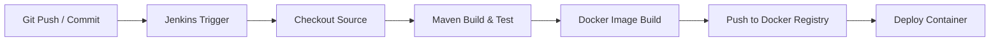

# Jenkins & Docker Integration Spring Boot Application

[](https://www.oracle.com/java/)
[](https://spring.io/projects/spring-boot)
[](https://www.docker.com/)
[](https://www.jenkins.io/)

A Spring Boot application demonstration configured for seamless containerization using **Docker** and continuous integration & deployment (CI/CD) with **Jenkins**.

---

## 📋 Table of Contents

- [Overview](#-overview)
- [Prerequisites](#-prerequisites)
- [Project Architecture & Directory Layout](#-project-architecture--directory-layout)
- [Getting Started](#-getting-started)
  - [1. Building Locally with Maven](#1-building-locally-with-maven)
  - [2. Running the Application](#2-running-the-application)
- [Docker Integration](#-docker-integration)
  - [Building the Docker Image](#building-the-docker-image)
  - [Running the Container](#running-the-container)
- [Jenkins CI/CD Pipeline Setup](#-jenkins-cicd-pipeline-setup)
  - [Pipeline Workflow](#pipeline-workflow)
  - [Sample Jenkinsfile](#sample-jenkinsfile)
- [Configuration Details](#-configuration-details)
- [License](#-license)

---

## 🔍 Overview

This repository provides a production-ready boilerplate for building Java microservices with **Spring Boot 3.3.4** and automating their lifecycle using **Docker** and **Jenkins**.

Key features:
- **Spring Boot Web**: Web application starter (`spring-boot-starter-web`) running on Java 17.
- **Dockerized**: Containerization using an optimized `Dockerfile`.
- **Jenkins CI/CD Ready**: Automated build, package, Docker image creation, and deployment support.

---

## 🛠 Prerequisites

Ensure the following tools are installed on your machine:

- **Java JDK 17** or higher
- **Maven 3.8+** (or use the included `./mvnw` Maven wrapper)
- **Docker Engine / Docker Desktop**
- **Git**
- **Jenkins Server** *(optional for local dev, required for CI/CD)*

---

## 📁 Project Architecture & Directory Layout

```text
jenkins-docker-integration/
├── Dockerfile                   # Docker build instructions
├── mvnw                         # Maven wrapper script (Unix/macOS)
├── mvnw.cmd                     # Maven wrapper script (Windows)
├── pom.xml                      # Maven project configuration & dependencies
├── src/
│   ├── main/
│   │   ├── java/
│   │   │   └── com/jenkins/docker/integration/
│   │   │       └── JenkinsDockersIntegrationApplication.java
│   │   └── resources/
│   │       └── application.properties
│   └── test/
│       └── java/
│           └── com/jenkins/docker/integration/
│               └── JenkinsDockersIntegrationApplicationTests.java
└── README.md                    # Project documentation
```

---

## 🚀 Getting Started

### 1. Building Locally with Maven

Clone the repository and build the project artifact using the Maven wrapper:

```bash
# Clone the repository
git clone https://github.com/raj4rr/jenkins-docker-integration.git
cd jenkins-docker-integration

# Clean and package the application (generates JAR in target/)
./mvnw clean package
```

### 2. Running the Application

You can run the application directly using Maven or Java executable JAR:

**Using Maven Wrapper:**
```bash
./mvnw spring-boot:run
```

**Using Java CLI:**
```bash
java -jar target/jenkins-dockers-integration.jar
```

The application will start on port `8080`. You can access it at: `http://localhost:8080`.

---

## 🐳 Docker Integration

The repository includes a `Dockerfile` to package the Spring Boot JAR into a Docker image.

### Building the Docker Image

1. First build the JAR artifact:
   ```bash
   ./mvnw clean package -DskipTests
   ```
2. Build the Docker image:
   ```bash
   docker build -t jenkins-dockers-integration:latest .
   ```

### Running the Container

Launch the application container and map host port `8080` to container port `8080`:

```bash
docker run -d \
  --name jenkins-docker-app \
  -p 8080:8080 \
  jenkins-dockers-integration:latest
```

Check running container logs:
```bash
docker logs -f jenkins-docker-app
```

Stop and remove the container:
```bash
docker stop jenkins-docker-app && docker rm jenkins-docker-app
```

---

## ⚙️ Jenkins CI/CD Pipeline Setup

### Pipeline Workflow



### Sample Jenkinsfile

You can create a `Jenkinsfile` in the root of your repository to automate CI/CD:

```groovy
pipeline {
    agent any

    tools {
        jdk 'JDK17'
        maven 'Maven3.9'
    }

    stages {
        stage('Checkout') {
            steps {
                git branch: 'main', url: 'https://github.com/raj4rr/jenkins-docker-integration.git'
            }
        }

        stage('Build & Test') {
            steps {
                sh './mvnw clean package'
            }
        }

        stage('Build Docker Image') {
            steps {
                script {
                    sh 'docker build -t raj4rr/jenkins-dockers-integration:${BUILD_NUMBER} .'
                    sh 'docker tag raj4rr/jenkins-dockers-integration:${BUILD_NUMBER} raj4rr/jenkins-dockers-integration:latest'
                }
            }
        }

        stage('Push to Docker Hub') {
            steps {
                script {
                    withCredentials([usernamePassword(credentialsId: 'docker-hub-credentials', usernameVariable: 'USER', passwordVariable: 'PASS')]) {
                        sh 'echo $PASS | docker login -u $USER --password-stdin'
                        sh 'docker push raj4rr/jenkins-dockers-integration:${BUILD_NUMBER}'
                        sh 'docker push raj4rr/jenkins-dockers-integration:latest'
                    }
                }
            }
        }
    }

    post {
        always {
            cleanWs()
        }
    }
}
```

---

## 📝 Configuration Details

- **Target Build Name**: Specified in `pom.xml` under `<finalName>jenkins-dockers-integration</finalName>`, producing `target/jenkins-dockers-integration.jar`.
- **Dockerfile Base Image**: Uses `openjdk17` exposing port `8080`.
- **Spring Boot Version**: `3.3.4` (Java 17 compatibility).

---

## 📄 License

This project is licensed under the MIT License - see the LICENSE file for details.
